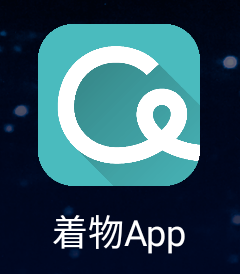
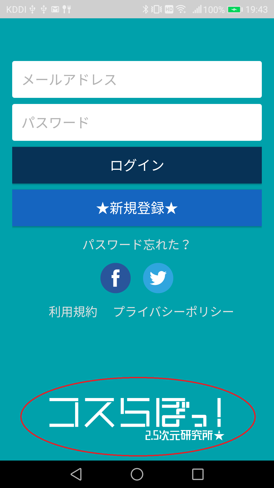

**必要なデザイン素材**（機能の取捨により追加）  
- アプリアイコン
- ロゴ
- スプラッシュ
- サイドメニュー内アイコン
- 投稿画面内アイコン
- イメージ
  - NowLoading
  - NoImage
  - NoPost
  - NoFriend
  - NoConnection  
---
- アプリアイコン  
  
→アプリ名決定後
---
- ロゴ  
  
→アプリ名決定後
---
- スプラッシュ  
  
→アプリ名決定後
---
- サイドメニュー内アイコン  
  
→アプリ名決定後
---
終わり
